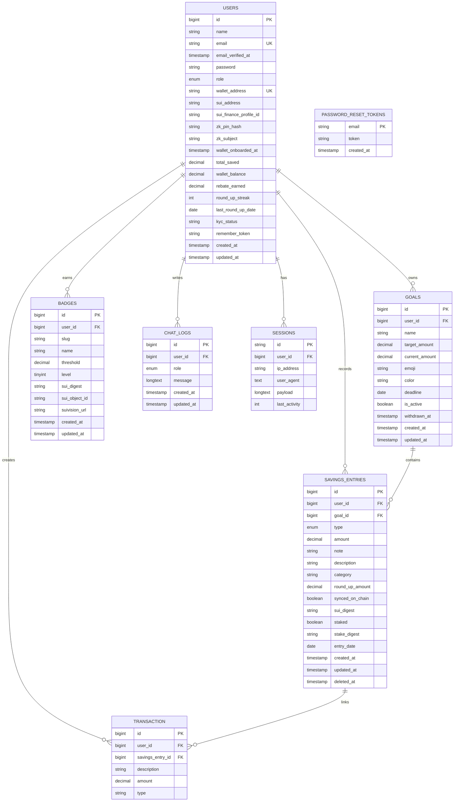

# ERD Diagram

```mermaid
erDiagram
    USERS {
        bigint id PK
        string name
        string email UK
        timestamp email_verified_at
        string password
        enum role
        string wallet_address UK
        string sui_address
        string sui_finance_profile_id
        string zk_pin_hash
        string zk_subject
        timestamp wallet_onboarded_at
        decimal total_saved
        decimal wallet_balance
        decimal rebate_earned
        int round_up_streak
        date last_round_up_date
        string kyc_status
        string remember_token
        timestamp created_at
        timestamp updated_at
    }

    GOALS {
        bigint id PK
        bigint user_id FK
        string name
        decimal target_amount
        decimal current_amount
        string emoji
        string color
        date deadline
        boolean is_active
        timestamp withdrawn_at
        timestamp created_at
        timestamp updated_at
    }

    SAVINGS_ENTRIES {
        bigint id PK
        bigint user_id FK
        bigint goal_id FK
        enum type
        decimal amount
        string note
        string description
        string category
        decimal round_up_amount
        boolean synced_on_chain
        string sui_digest
        boolean staked
        string stake_digest
        date entry_date
        timestamp created_at
        timestamp updated_at
        timestamp deleted_at
    }

    TRANSACTION {
        bigint id PK
        bigint user_id FK
        bigint savings_entry_id FK
        string description
        decimal amount
        string type
    }

    BADGES {
        bigint id PK
        bigint user_id FK
        string slug
        string name
        decimal threshold
        tinyint level
        string sui_digest
        string sui_object_id
        string suivision_url
        timestamp created_at
        timestamp updated_at
    }

    CHAT_LOGS {
        bigint id PK
        bigint user_id FK
        enum role
        longtext message
        timestamp created_at
        timestamp updated_at
    }

    PASSWORD_RESET_TOKENS {
        string email PK
        string token
        timestamp created_at
    }

    SESSIONS {
        string id PK
        bigint user_id FK
        string ip_address
        text user_agent
        longtext payload
        int last_activity
    }

    USERS ||--o{ GOALS : owns
    USERS ||--o{ SAVINGS_ENTRIES : records
    USERS ||--o{ TRANSACTION : creates
    USERS ||--o{ BADGES : earns
    USERS ||--o{ CHAT_LOGS : writes
    USERS ||--o{ SESSIONS : has
    GOALS ||--o{ SAVINGS_ENTRIES : contains
    SAVINGS_ENTRIES ||--o{ TRANSACTION : links
```
